# Documentación Técnica: Autenticación Centralizada con RADIUS (NPS) + AAA en Router Cisco + Publicación de Aplicaciones con RemoteApp

**Autor:** Junior Javier Santos Pérez — Matrícula 2024-1599

---

## 1. Objetivo de la red

Diseñar e implementar una infraestructura de red que centralice la autenticación, autorización y auditoría (**AAA**) de los administradores de un router Cisco utilizando un servidor **RADIUS (NPS)** integrado con **Active Directory**, y que además permita a los usuarios finales acceder de forma remota a una aplicación publicada (**RemoteApp**) y a un sitio web corporativo (**IIS**), a través de dos métodos de acceso RDP: el cliente clásico (**RD Web Access**) y el cliente web moderno (**RD Web Client / HTML5**).

Con esto se busca demostrar:
- Enrutamiento básico entre dos segmentos de red separados por un router.
- Control de acceso administrativo diferenciado por niveles de privilegio (15 y 1) mediante RADIUS.
- Redundancia de autenticación (RADIUS con respaldo local) para evitar bloqueos del equipo.
- Publicación segura de aplicaciones y contenido web a usuarios remotos.

---

## 2. Topología de red

**Imagen 1.** Diagrama completo de la topología en PNETLab: router `R1` con tres interfaces (Internet/NAT, LAN Servidores, LAN Clientes), dos switches (`SW4` y `SW5`) y los dos hosts finales (`Win` y `Winserver`).

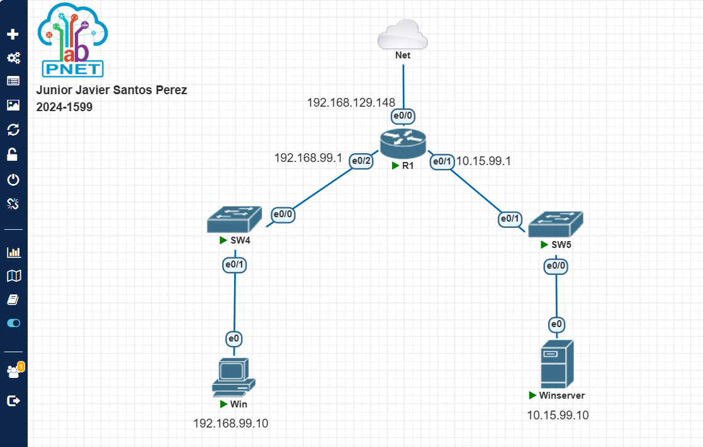

### 2.1 Direccionamiento IP

| Dispositivo | Interfaz | Dirección IP | Máscara | Puerta de enlace |
|---|---|---|---|---|
| R1 | Ethernet0/0 (WAN/NAT) | 192.168.129.148 (DHCP) | /24 | — |
| R1 | Ethernet0/1 (LAN Servidores) | 10.15.99.1 | 255.255.255.0 | — |
| R1 | Ethernet0/2 (LAN Clientes) | 192.168.99.1 | 255.255.255.0 | — |
| Winserver (DC01) | Ethernet | 10.15.99.10 | 255.255.255.0 | 10.15.99.1 |
| Win (Cliente) | Ethernet | 192.168.99.10 | 255.255.255.0 | 192.168.99.1 |

> No se emplearon VLANs; la segmentación se logra mediante interfaces físicas independientes del router conectadas a switches de acceso distintos (SW4 para la red de clientes, SW5 para la red de servidores).

### 2.2 Roles por dispositivo

| Equipo | Rol funcional |
|---|---|
| R1 (Cisco IOS 15.7) | Enrutador de borde, cliente RADIUS, servidor SSH, AAA |
| Winserver (DC01) | Controlador de Dominio (AD DS), Servidor RADIUS (NPS), IIS, Servicios de Escritorio Remoto (RDS) |
| Win | Estación cliente para pruebas de SSH y RemoteApp |

---

## 3. Configuración de Active Directory y NPS (Servidor RADIUS)

**Imagen 2.** Propiedades del servidor local `DC01` mostrando el dominio `lab.local`, la dirección IP `10.15.99.10` y los roles instalados (AD DS, DNS, IIS, NPAS, Servicios de Escritorio remoto) visibles en el panel izquierdo del Administrador del servidor.

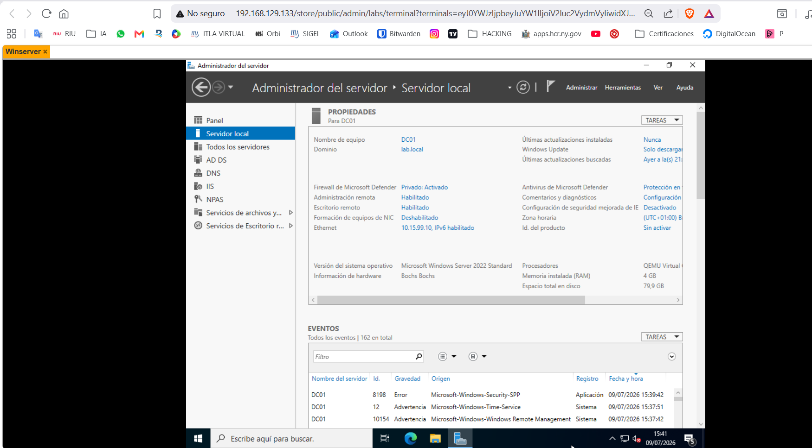

En Active Directory se creó la unidad organizativa `RADIUS`, con dos grupos de seguridad globales (`Nivel15` y `Nivel1`) y dos usuarios (`radius15` y `radius1`), cada uno asignado a su grupo correspondiente, para diferenciar el nivel de privilegio que NPS entregará al router.

**Imagen 3.** Propiedades del cliente RADIUS `R1` dado de alta en NPS: dirección `10.15.99.1` y secreto compartido configurado manualmente (debe coincidir exactamente con el configurado en el router).

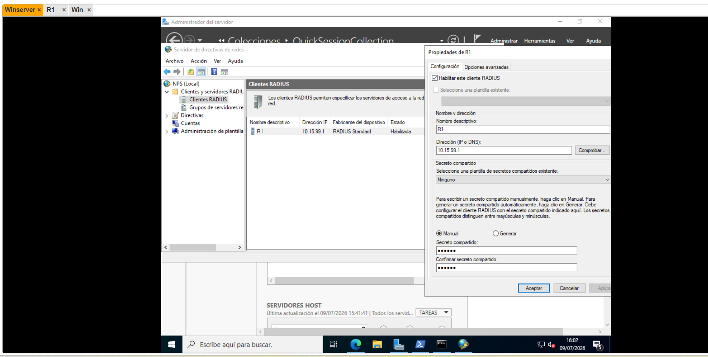

Sobre este cliente RADIUS se construyeron dos directivas de red en NPS:

- **Acceso-Nivel15**: aplica al grupo `Nivel15`, entrega el atributo Cisco `Cisco-AV-Pair = shell:priv-lvl=15`.
- **Acceso-Nivel1**: aplica al grupo `Nivel1`, entrega `Cisco-AV-Pair = shell:priv-lvl=1`.

Ambas directivas usan autenticación PAP/SPAP y `Service-Type = Login`, requisitos para que un router Cisco interprete correctamente la respuesta RADIUS como una sesión administrativa (shell) y no como una conexión de red (Framed/PPP).

---

## 4. Configuración del Router — AAA, RADIUS y SSH

### 4.1 Habilitación de AAA y RADIUS

**Imagen 4.** Fragmento de la configuración en ejecución (`show running-config`) mostrando `enable secret`, la activación de `aaa new-model`, el grupo de servidores `aaa group server radius RADIUS-GROUP` apuntando al servidor lógico `NPS1`, y las líneas de autenticación/autorización por defecto usando RADIUS con respaldo local.

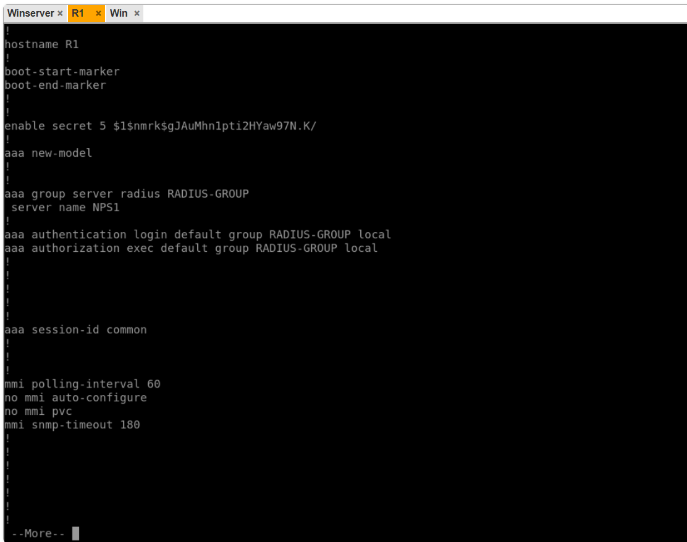

**Imagen 5.** Continuación de la configuración, confirmando nuevamente el bloque `hostname`, `enable secret`, `aaa new-model`, el grupo `RADIUS-GROUP` y las políticas `aaa authentication login default` / `aaa authorization exec default`.

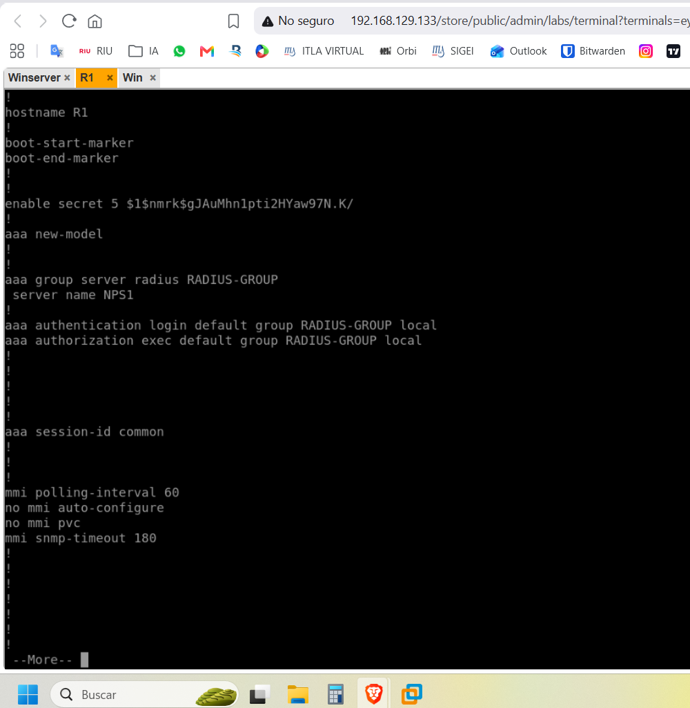

```bash
hostname R1
enable secret 5 $1$nmrk$gJAuMhn1pti2HYaw97N.K/
aaa new-model

aaa group server radius RADIUS-GROUP
 server name NPS1

aaa authentication login default group RADIUS-GROUP local
aaa authorization exec default group RADIUS-GROUP local
aaa session-id common
```

### 4.2 Interfaces y servidor RADIUS declarado

**Imagen 6.** Configuración de las tres interfaces Ethernet del router (WAN con NAT/DHCP, LAN Servidores y LAN Clientes), la interfaz `Ethernet0/3` deshabilitada por no uso, la ruta por defecto vía DHCP, SSH versión 2 habilitado, y la declaración del servidor RADIUS `NPS1` apuntando a `10.15.99.10` con el secreto compartido.

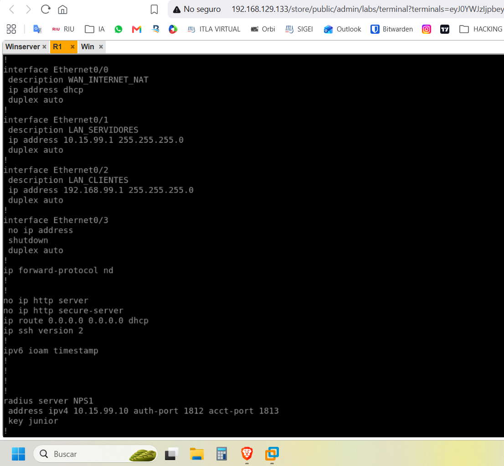

```bash
interface Ethernet0/0
 description WAN_INTERNET_NAT
 ip address dhcp

interface Ethernet0/1
 description LAN_SERVIDORES
 ip address 10.15.99.1 255.255.255.0

interface Ethernet0/2
 description LAN_CLIENTES
 ip address 192.168.99.1 255.255.255.0

ip route 0.0.0.0 0.0.0.0 dhcp
ip ssh version 2

radius server NPS1
 address ipv4 10.15.99.10 auth-port 1812 acct-port 1813
 key junior
```

### 4.3 Líneas de acceso y verificación de interfaces

**Imagen 7.** Configuración de `line con 0`, `line vty 0 4` con `transport input ssh`, servidores NTP, y salida de `show ip interface brief` confirmando las tres interfaces activas (`up/up`), excepto la no utilizada (`administratively down`).

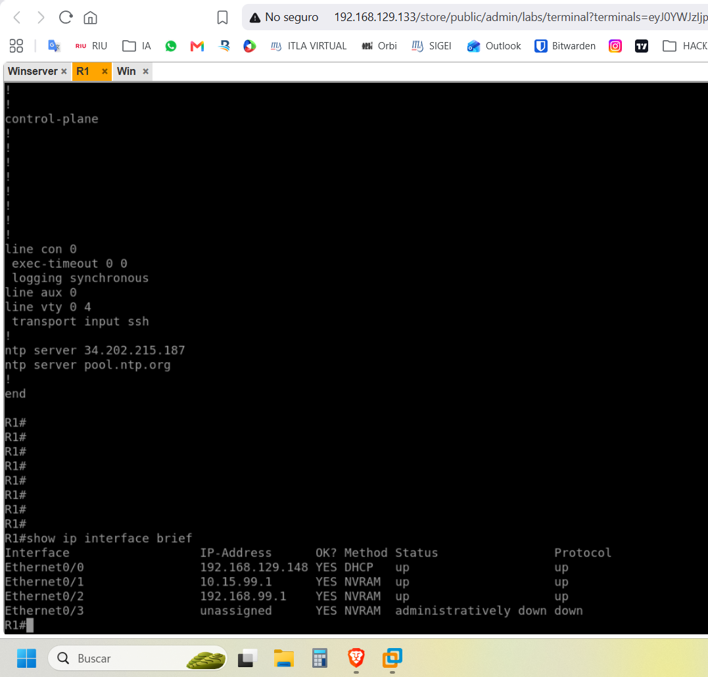

---

## 5. Verificación de AAA/RADIUS (debug y show)

**Imagen 8.** Activación de los tres comandos de depuración solicitados (`debug aaa authentication`, `debug aaa authorization`, `debug radius`) y primera parte de la salida de `show aaa servers`, donde se observa el servidor `10.15.99.10` en estado **current UP**.

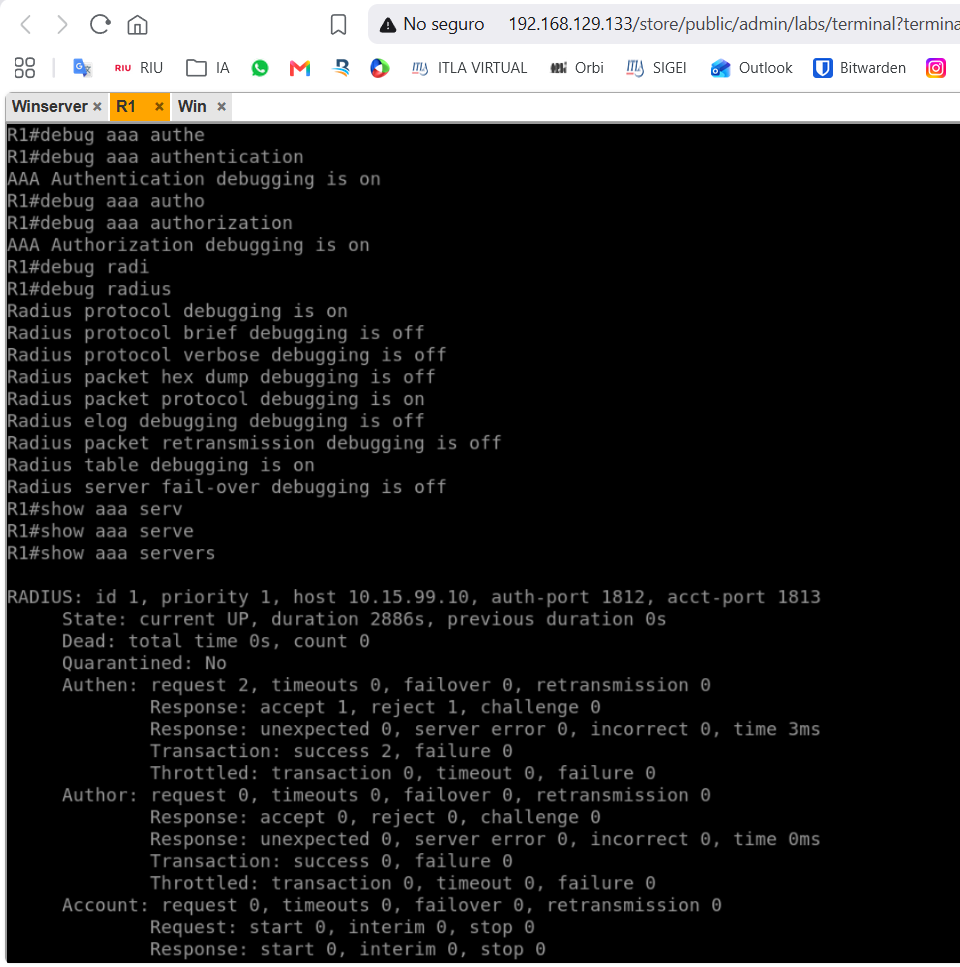

**Imagen 9.** Continuación de `show aaa servers` (contadores de transacciones) y salida de `show aaa sessions`, mostrando las sesiones AAA registradas desde el último reinicio del router.

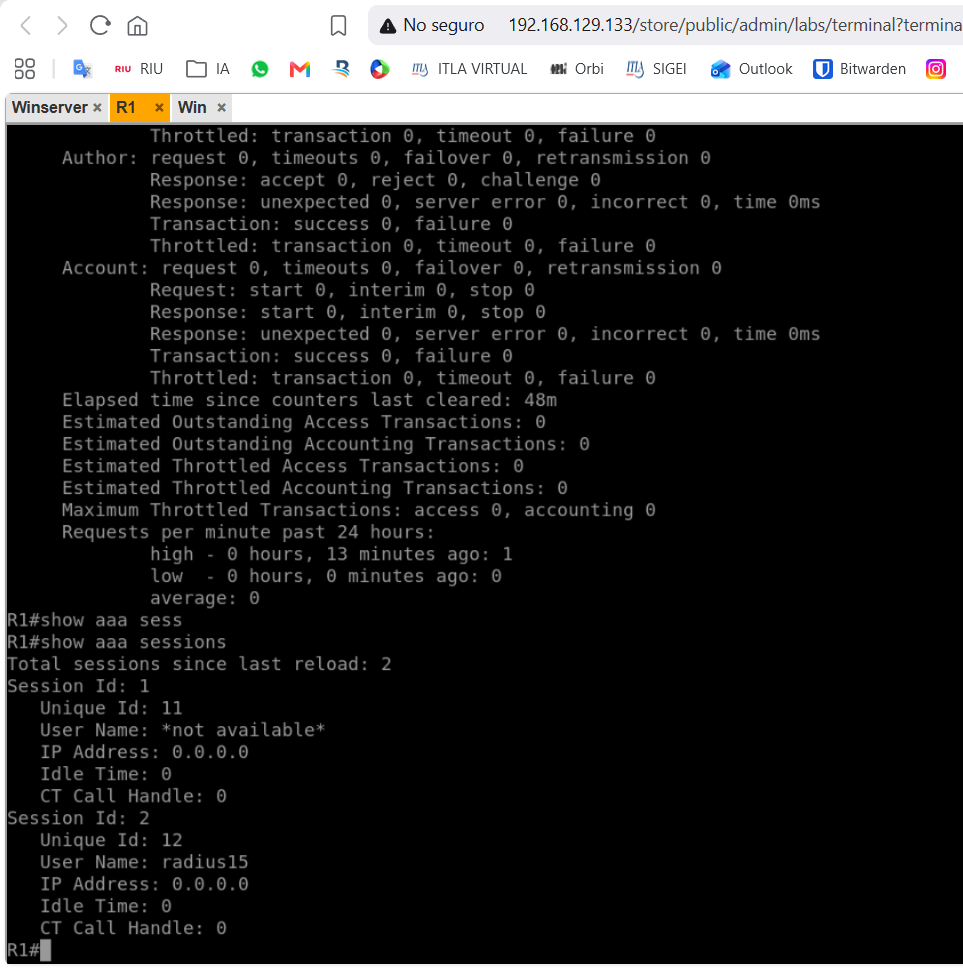

**Imagen 10.** Conexión SSH realizada **desde el cliente Win** hacia el router (`ssh radius15@192.168.99.1`), verificación de `show aaa sessions` (sesión activa con `User Name: radius15`) y confirmación final con `show privilege`, resultando en **privilegio 15**.

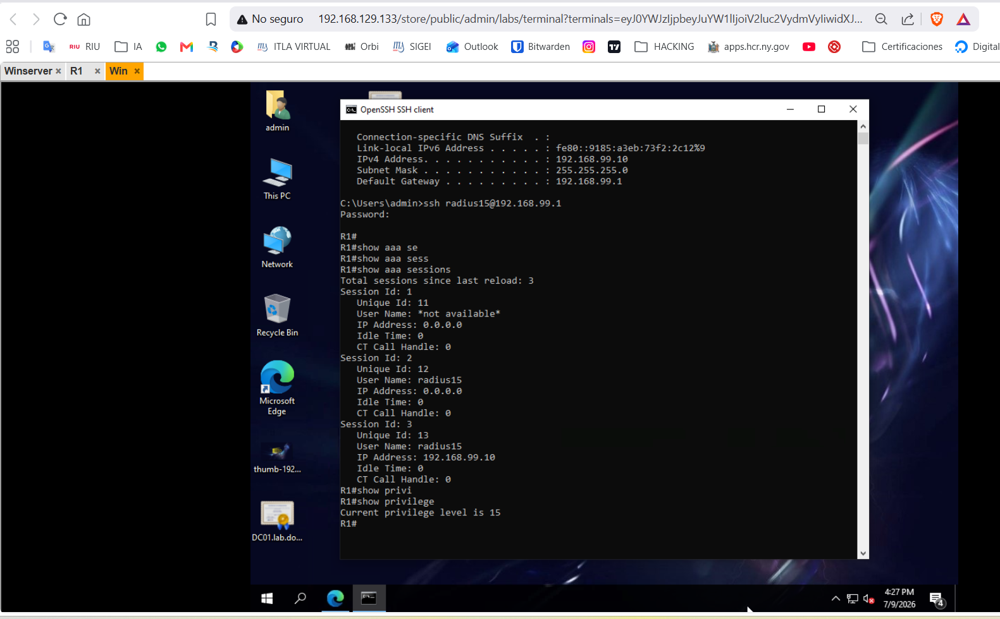

**Imagen 11.** Detalle del intercambio RADIUS capturado por `debug radius`: el paquete `Access-Request` con el usuario `radius15`, la respuesta `Access-Accept`, el atributo `Cisco AVpair = "shell:priv-lvl=15"` y el mensaje final `AAA/AUTHOR/EXEC: Authorization successful`.

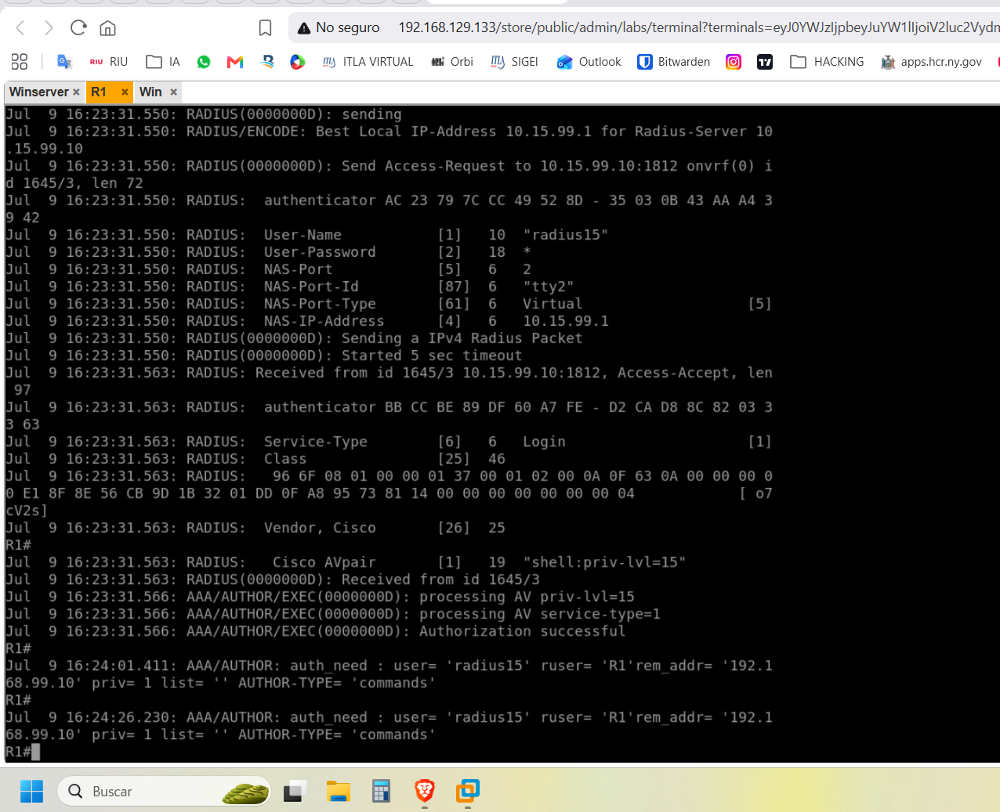

Esta secuencia confirma el flujo completo de autenticación y autorización:

```
Router (Access-Request) → NPS (consulta AD) → NPS (Access-Accept + Cisco-AV-Pair) → Router (aplica privilegio)
```

---

## 6. Publicación de aplicaciones — RemoteApp

**Imagen 12.** Panel de administración de la colección `QuickSessionCollection`, listando los programas RemoteApp publicados: Calculadora, Microsoft Edge, Paint y WordPad, todos visibles en el Acceso web de Escritorio remoto. En el panel derecho se observa la conexión activa del usuario `LAB\Administrador`.

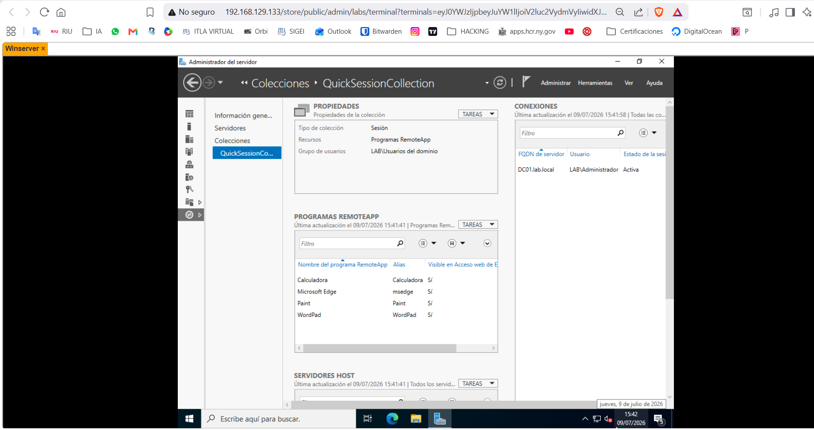

Microsoft Edge se configuró con un argumento de línea de comandos fijo (`http://10.15.99.10`) para que, al ejecutarse como RemoteApp, abra automáticamente la página personalizada de IIS.

**Imagen 13.** Verificación por PowerShell de que el paquete del **RD Web Client (HTML5)** y su publicación ya se encuentran instalados (`Install-RDWebClientPackage` / `Publish-RDWebClientPackage`), componente necesario para el acceso desde navegador sin cliente RDP tradicional.

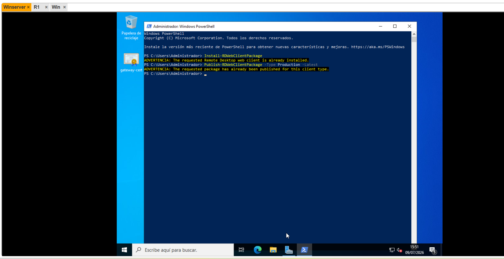

---

## 7. Página personalizada de IIS

**Imagen 14.** Verificación de red del `Winserver`: dirección IP `10.15.99.10`, máscara `/24` y puerta de enlace `10.15.99.1`, confirmando la conectividad de la red de servidores.

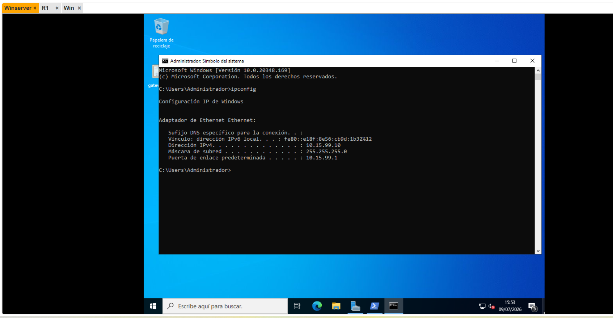

**Imagen 15.** Página web personalizada cargando correctamente en `http://localhost` desde el propio servidor, mostrando el título "Bienvenido al Servidor DC01" y los datos del estudiante.

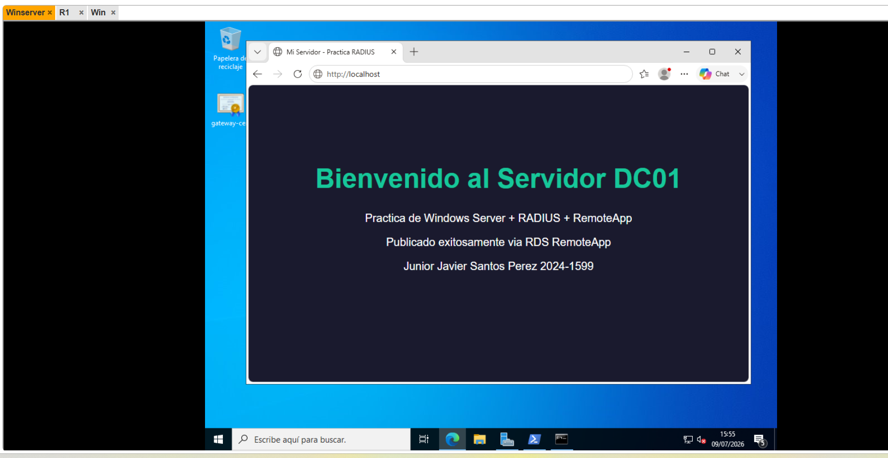

**Imagen 16.** Contenido de la carpeta raíz de IIS (`C:\inetpub\wwwroot`), mostrando el archivo `iisstart` modificado, el certificado `gateway-cert` exportado y la carpeta `aspnet_client` (dependencia estándar de IIS/RD Web Access).

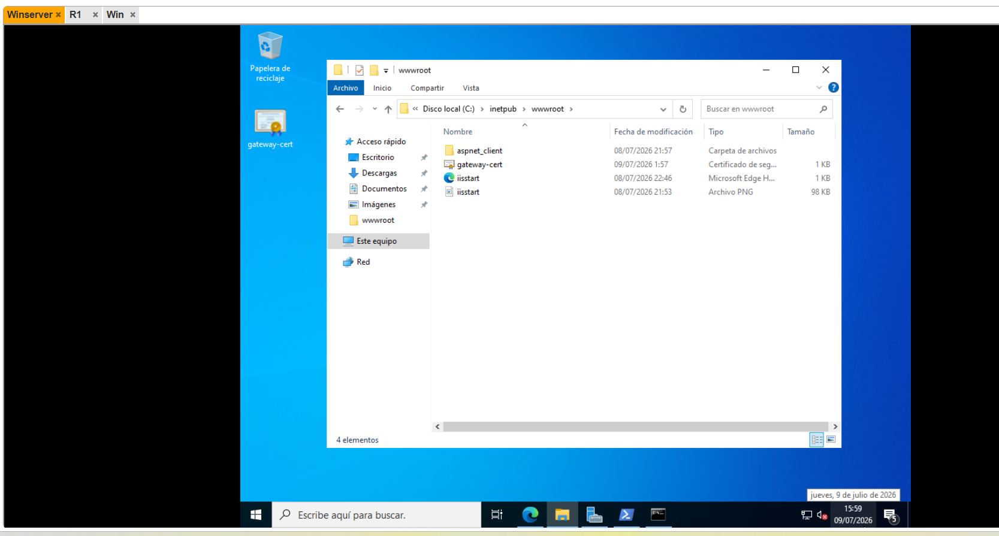

**Imagen 17.** Código fuente HTML/CSS de la página personalizada abierto en el Bloc de notas, mostrando el estilo (fondo oscuro, texto verde) y el contenido con los datos del estudiante.

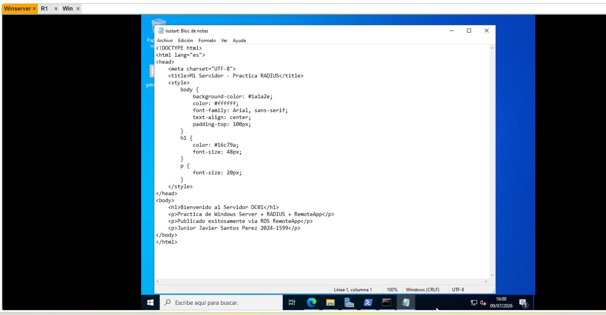

---

## 8. Pruebas finales desde el Cliente (Win)

**Imagen 18.** Verificación de la configuración de red del cliente `Win`: dirección IP `192.168.99.10`, máscara `/24` y puerta de enlace `192.168.99.1`, confirmando que pertenece a la LAN de clientes.

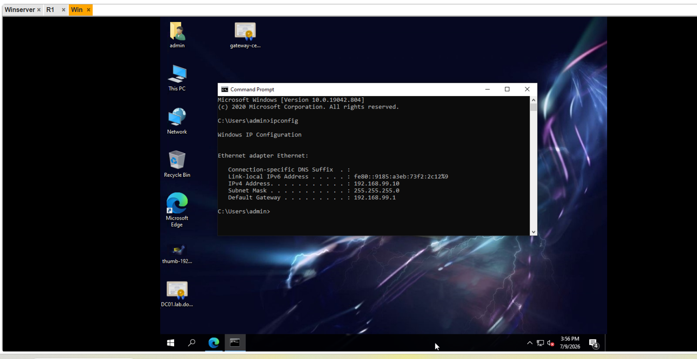

### 8.1 Acceso mediante RD Web Client (HTML5)

**Imagen 19.** Pantalla de inicio de sesión del **Remote Desktop Web Client** (`https://dc01.lab.local/RDWeb/webclient/`) con las credenciales `LAB\radius15`.

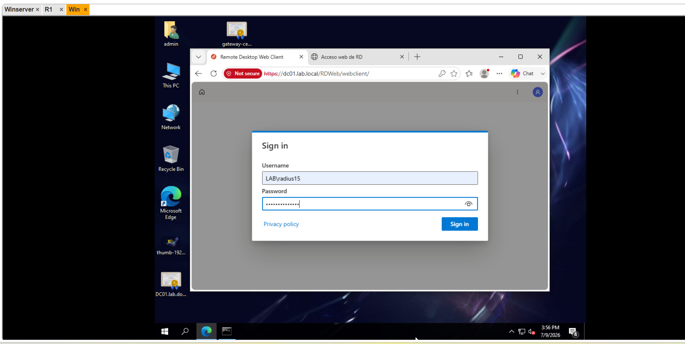

**Imagen 20.** Panel "Work Resources" tras autenticarse correctamente, mostrando los cuatro programas RemoteApp disponibles: Calculadora, Microsoft Edge, Paint y WordPad.

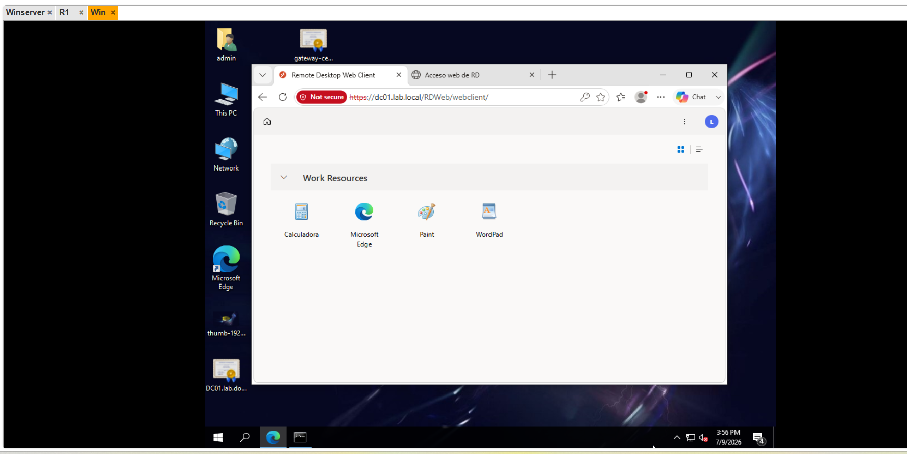

**Imagen 21.** Proceso de conexión al lanzar la RemoteApp "Microsoft Edge" desde el navegador (mensaje "Connecting and launching Microsoft Edge — Configuring remote connection").

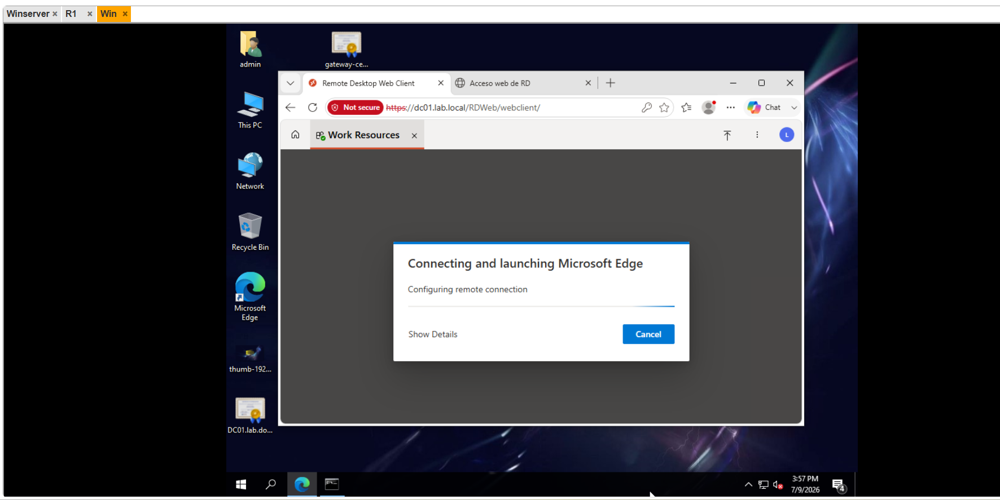

**Imagen 22.** Resultado final: Microsoft Edge, ejecutándose como RemoteApp dentro del navegador del cliente, mostrando exitosamente la página personalizada de IIS (`10.15.99.10`).

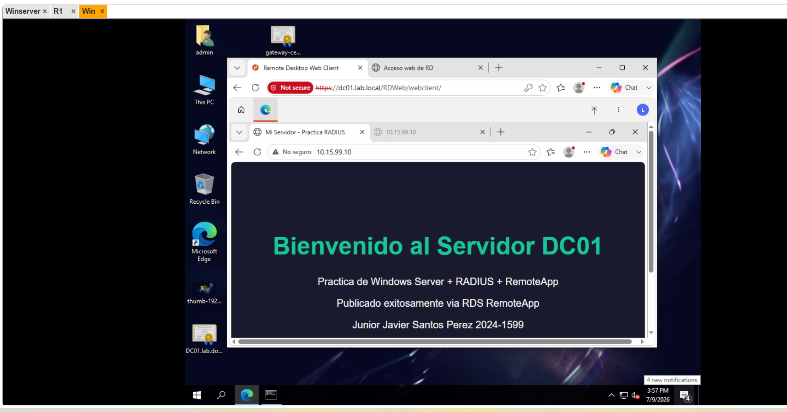

### 8.2 Acceso mediante RD Web Access (clásico)

Adicionalmente se verificó el segundo servicio solicitado por la tarea: el acceso clásico vía `https://dc01.lab.local/RDWeb/Pages/es-ES/default.aspx`, el cual descarga un archivo `.rdp` que, al ejecutarse, abre igualmente Microsoft Edge apuntando a la página de IIS, confirmando el correcto funcionamiento de **ambos** servicios RemoteApp exigidos por la práctica.

### 8.3 Prueba de SSH al router vía RADIUS (desde el Cliente)

Como se documentó en la **Imagen 10**, la conexión SSH desde el cliente `Win` hacia el router (`ssh radius15@192.168.99.1`) fue autenticada exitosamente contra NPS, y el router asignó automáticamente el **privilegio 15**, confirmado con `show privilege`.

---

## 9. Resumen de cumplimiento de la tarea

| Requisito | Estado | Evidencia |
|---|---|---|
| Topología de red | ✅ | Imagen 1 |
| RDP RemoteApp | ✅ | Imágenes 12, 21, 22 |
| RDP RemoteApp Web Client | ✅ | Imágenes 13, 19, 20 |
| Página personalizada de IIS | ✅ | Imágenes 15, 16, 17 |
| Publicación de IIS en RemoteApp | ✅ | Imágenes 12, 22 |
| NPS (RADIUS Server) | ✅ | Imágenes 2, 3 |
| Grupo nivel de acceso 15 | ✅ | Sección 3 / Imagen 11 |
| Grupo nivel de acceso 1 | ✅ | Sección 3 |
| Usuario local en el router | ✅ | Sección 4.1 |
| AAA vía RADIUS | ✅ | Imágenes 4, 5, 6 |
| Contraseña de modo configuración | ✅ | Imágenes 4, 5 |
| debug aaa authentication | ✅ | Imagen 8 |
| debug aaa authorization | ✅ | Imagen 8 |
| debug radius | ✅ | Imágenes 8, 11 |
| show aaa servers | ✅ | Imágenes 8, 9 |
| show aaa sessions | ✅ | Imágenes 9, 10 |
| Consulta de la página vía los 2 RemoteApp (Cliente) | ✅ | Imagen 22, Sección 8.2 |
| Prueba de SSH al router vía RADIUS (Cliente) | ✅ | Imagen 10 |

---

## 10. Estructura de archivos entregados

```
/
├── README.md              (este documento)
└── imagenes/
    ├── IMAGEN1.png   → Topología de red
    ├── IMAGEN2.png   → Propiedades del servidor DC01
    ├── IMAGEN3.png   → Cliente RADIUS R1 en NPS
    ├── IMAGEN4.png   → Configuración AAA (running-config)
    ├── IMAGEN5.png   → Configuración AAA (continuación)
    ├── IMAGEN6.png   → Interfaces y servidor RADIUS
    ├── IMAGEN7.png   → Líneas VTY / show ip interface brief
    ├── IMAGEN8.png   → Debugs AAA/RADIUS y show aaa servers
    ├── IMAGEN9.png   → show aaa servers (cont.) y show aaa sessions
    ├── IMAGEN10.png  → SSH desde Cliente + show privilege
    ├── IMAGEN11.png  → Detalle RADIUS Access-Accept / Cisco-AV-Pair
    ├── IMAGEN12.png  → Programas RemoteApp publicados
    ├── IMAGEN13.png  → RD Web Client instalado (PowerShell)
    ├── IMAGEN14.png  → IP del Winserver
    ├── IMAGEN15.png  → Página IIS en localhost
    ├── IMAGEN16.png  → Carpeta wwwroot de IIS
    ├── IMAGEN17.png  → Código HTML de la página personalizada
    ├── IMAGEN18.png  → IP del Cliente Win
    ├── IMAGEN19.png  → Login RD Web Client
    ├── IMAGEN20.png  → Work Resources (RemoteApps disponibles)
    ├── IMAGEN21.png  → Lanzando RemoteApp Microsoft Edge
    └── IMAGEN22.png  → Microsoft Edge mostrando la página de IIS
```
